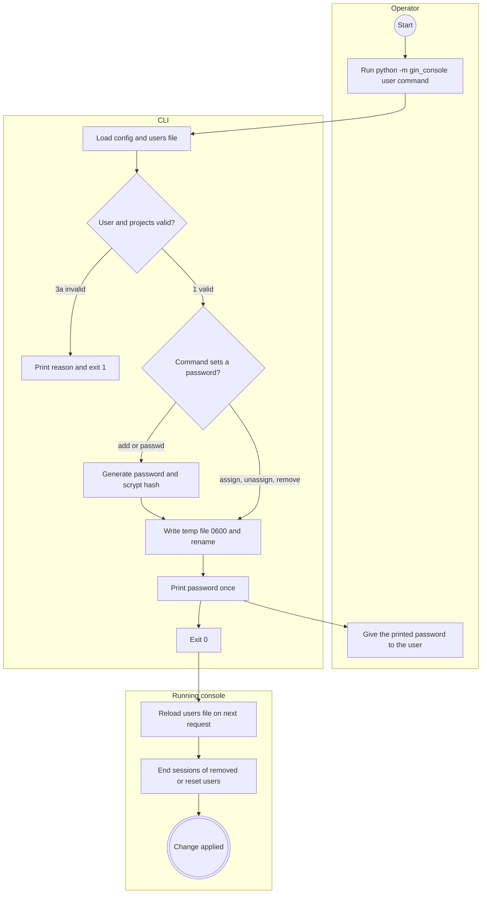

# Manage users activity

Use case: manage-users

How a `user` CLI command changes the users file, and how the running console picks the change up.

```mermaid
flowchart TD
  subgraph operator[Operator]
    start((Start))
    run[Run python -m gin_console user command]
    share[Give the printed password to the user]
  end
  subgraph cli[CLI]
    load[Load config and users file]
    valid{User and projects valid?}
    fail[Print reason and exit 1]
    gen{Command sets a password?}
    newpw[Generate password and scrypt hash]
    write[Write temp file 0600 and rename]
    print[Print password once]
    ok[Exit 0]
  end
  subgraph console[Running console]
    reload[Reload users file on next request]
    revoke[End sessions of removed or reset users]
    done(((Change applied)))
  end
  start --> run
  run --> load
  load --> valid
  valid -->|3a invalid| fail
  valid -->|1 valid| gen
  gen -->|add or passwd| newpw
  newpw --> write
  gen -->|assign, unassign, remove| write
  write --> print
  print --> share
  print --> ok
  ok --> reload
  reload --> revoke
  revoke --> done
```
