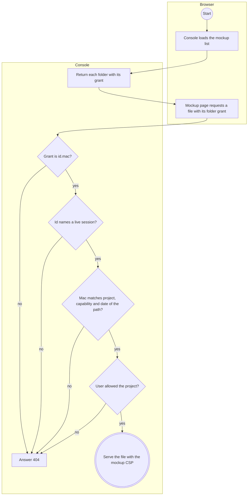

# Mockup grant activity

How a sandboxed mockup's file request is checked while auth is on.

```mermaid
flowchart TD
  subgraph browser[Browser]
    start((Start))
    list[Console loads the mockup list]
    frame[Mockup page requests a file with its folder grant]
  end
  subgraph system[Console]
    grants[Return each folder with its grant]
    parse{Grant is id.mac?}
    live{Id names a live session?}
    mac{Mac matches project, capability and date of the path?}
    allowed{User allowed the project?}
    notFound[Answer 404]
    serve(((Serve the file with the mockup CSP)))
  end
  start --> list
  list --> grants
  grants --> frame
  frame --> parse
  parse -->|no| notFound
  parse -->|yes| live
  live -->|no| notFound
  live -->|yes| mac
  mac -->|no| notFound
  mac -->|yes| allowed
  allowed -->|no| notFound
  allowed -->|yes| serve
```
