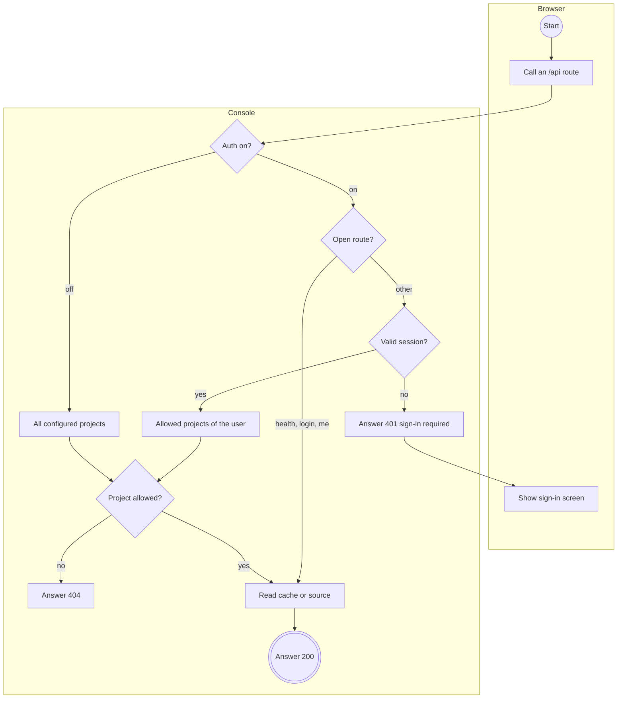

# Project access activity

How an API request reaches project data: the session check, then the allowed projects, then the cache.

```mermaid
flowchart TD
  subgraph client[Browser]
    start((Start))
    request[Call an /api route]
    signin[Show sign-in screen]
  end
  subgraph system[Console]
    authOn{Auth on?}
    open{Open route?}
    session{Valid session?}
    deny[Answer 401 sign-in required]
    allowed[Allowed projects of the user]
    all[All configured projects]
    inList{Project allowed?}
    notFound[Answer 404]
    cache[Read cache or source]
    answer(((Answer 200)))
  end
  start --> request
  request --> authOn
  authOn -->|off| all
  authOn -->|on| open
  open -->|health, login, me| cache
  open -->|other| session
  session -->|no| deny
  deny --> signin
  session -->|yes| allowed
  allowed --> inList
  all --> inList
  inList -->|no| notFound
  inList -->|yes| cache
  cache --> answer
```
