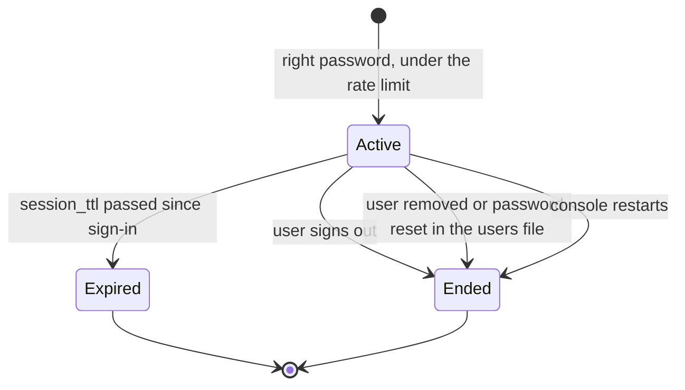

# Session state

A sign-in session, held in the console's memory (`auth/sessions.py`) and named by the `gin_console_session` cookie.

```mermaid
stateDiagram-v2
  [*] --> Active: right password, under the rate limit
  Active --> Expired: session_ttl passed since sign-in
  Active --> Ended: user signs out
  Active --> Ended: user removed or password reset in the users file
  Active --> Ended: console restarts
  Expired --> [*]
  Ended --> [*]
```
