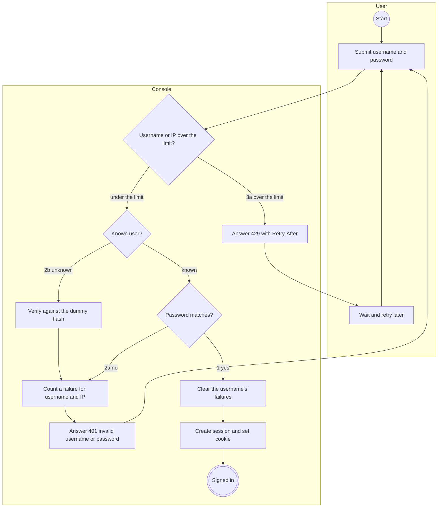

# Sign-in activity

Use case: sign-in

How a sign-in request is answered while auth is on: rate limit first, then the password, then a session.

```mermaid
flowchart TD
  subgraph user[User]
    start((Start))
    submit[Submit username and password]
    wait[Wait and retry later]
  end
  subgraph system[Console]
    limited{Username or IP over the limit?}
    tooMany[Answer 429 with Retry-After]
    known{Known user?}
    dummy[Verify against the dummy hash]
    verify{Password matches?}
    count[Count a failure for username and IP]
    reject[Answer 401 invalid username or password]
    clear[Clear the username's failures]
    session[Create session and set cookie]
    done(((Signed in)))
  end
  start --> submit
  submit --> limited
  limited -->|3a over the limit| tooMany
  tooMany --> wait
  wait --> submit
  limited -->|under the limit| known
  known -->|2b unknown| dummy
  dummy --> count
  known -->|known| verify
  verify -->|2a no| count
  count --> reject
  reject --> submit
  verify -->|1 yes| clear
  clear --> session
  session --> done
```
