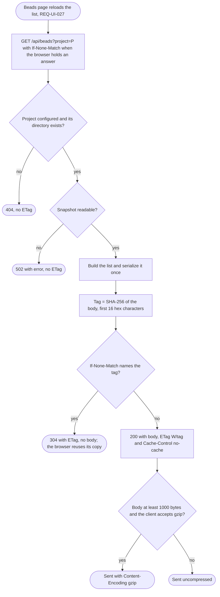

# Bead list transfer

How a reload of the bead list becomes a 304, a full answer or a compressed answer (REQ-BEADS-014, REQ-SERVER-011).

```mermaid
flowchart TD
  poll([Beads page reloads the list, REQ-UI-027]) --> req[GET /api/beads?project=P with If-None-Match when the browser holds an answer]
  req --> proj{Project configured and its directory exists?}
  proj -- no --> nf([404, no ETag])
  proj -- yes --> snap{Snapshot readable?}
  snap -- no --> err([502 with error, no ETag])
  snap -- yes --> body[Build the list and serialize it once]
  body --> tag[Tag = SHA-256 of the body, first 16 hex characters]
  tag --> match{If-None-Match names the tag?}
  match -- yes --> nm([304 with ETag, no body; the browser reuses its copy])
  match -- no --> ok[200 with body, ETag W/tag and Cache-Control no-cache]
  ok --> gz{Body at least 1000 bytes and the client accepts gzip?}
  gz -- yes --> zip([Sent with Content-Encoding gzip])
  gz -- no --> plain([Sent uncompressed])
```
