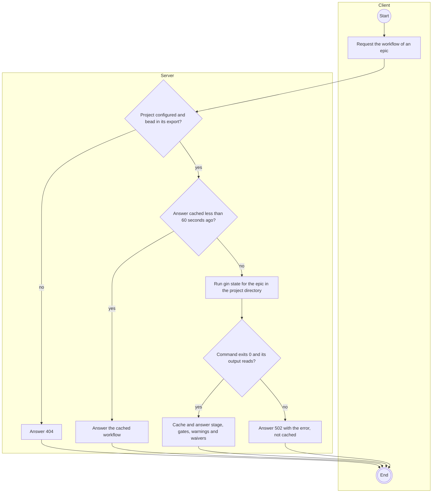

# Workflow of an epic

How the server answers the gin-workflow state of one epic for the epic page (REQ-BEADS-020).

```mermaid
flowchart TD
  subgraph client[Client]
    start((Start))
    request[Request the workflow of an epic]
    done(((End)))
  end
  subgraph server[Server]
    known{Project configured and bead in its export?}
    notFound[Answer 404]
    cached{Answer cached less than 60 seconds ago?}
    reuse[Answer the cached workflow]
    run[Run gin state for the epic in the project directory]
    ok{Command exits 0 and its output reads?}
    answer[Cache and answer stage, gates, warnings and waivers]
    fail[Answer 502 with the error, not cached]
  end
  start --> request
  request --> known
  known -->|no| notFound
  known -->|yes| cached
  cached -->|yes| reuse
  cached -->|no| run
  run --> ok
  ok -->|yes| answer
  ok -->|no| fail
  notFound --> done
  reuse --> done
  answer --> done
  fail --> done
```
