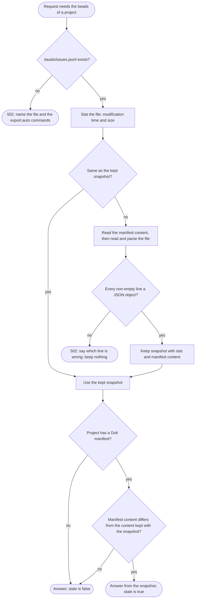

# Export read

How the server gets a project's beads from `.beads/issues.jsonl` and decides whether they may be stale (REQ-BEADS-004, REQ-BEADS-005, REQ-BEADS-012, REQ-BEADS-013).

```mermaid
flowchart TD
  start([Request needs the beads of a project]) --> exists{.beads/issues.jsonl exists?}
  exists -- no --> missing([502: name the file and the export.auto commands])
  exists -- yes --> stat[Stat the file: modification time and size]
  stat --> same{Same as the kept snapshot?}
  same -- yes --> kept[Use the kept snapshot]
  same -- no --> read[Read the manifest content, then read and parse the file]
  read --> ok{Every non-empty line a JSON object?}
  ok -- no --> bad([502: say which line is wrong; keep nothing])
  ok -- yes --> keep[Keep snapshot with stat and manifest content] --> kept
  kept --> manifest{Project has a Dolt manifest?}
  manifest -- no --> fresh([Answer; stale is false])
  manifest -- yes --> differs{Manifest content differs from the content kept with the snapshot?}
  differs -- no --> fresh
  differs -- yes --> stale([Answer from the snapshot; stale is true])
```
