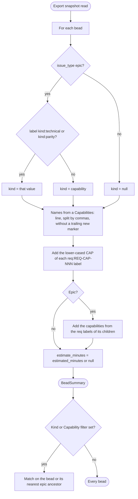

# Kind and capabilities of a bead

How the bead list derives `kind`, `capabilities` and `estimate_minutes` for each bead (REQ-BEADS-001), and how the filters use them (REQ-UI-108).

```mermaid
flowchart TD
  start([Export snapshot read]) --> each[For each bead]
  each --> epic{issue_type epic?}
  epic -- yes --> kind{label kind:technical or kind:parity?}
  kind -- yes --> k1[kind = that value]
  kind -- no --> k2[kind = capability]
  epic -- no --> k3[kind = null]
  k1 --> caps
  k2 --> caps
  k3 --> caps[Names from a Capabilities: line, split by commas, without a trailing new marker]
  caps --> req[Add the lower-cased CAP of each req:REQ-CAP-NNN label]
  req --> kids{Epic?}
  kids -- yes --> union[Add the capabilities from the req labels of its children]
  kids -- no --> est
  union --> est[estimate_minutes = estimated_minutes or null]
  est --> out([BeadSummary])
  out --> filter{Kind or Capability filter set?}
  filter -- yes --> match[Match on the bead or its nearest epic ancestor]
  filter -- no --> all([Every bead])
```
