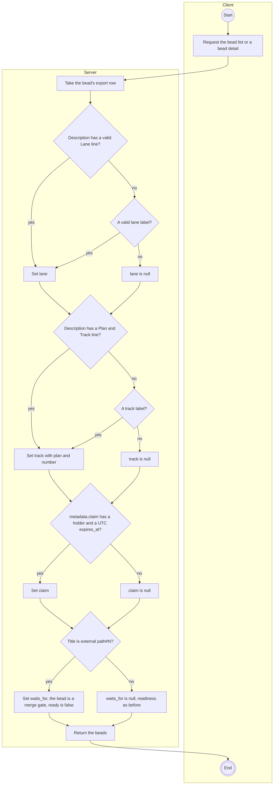

# Lane fields

How the server adds `lane`, `track`, `claim` and `waits_for` to each bead of the list and the detail (REQ-BEADS-019), and how a merge gate is kept out of readiness (REQ-BEADS-007).

```mermaid
flowchart TD
  subgraph client[Client]
    start((Start))
    request[Request the bead list or a bead detail]
    done(((End)))
  end
  subgraph server[Server]
    row[Take the bead's export row]
    laneLine{Description has a valid Lane line?}
    laneLabel{A valid lane label?}
    setLane[Set lane]
    noLane[lane is null]
    planLine{Description has a Plan and Track line?}
    trackLabel{A track label?}
    setTrack[Set track with plan and number]
    noTrack[track is null]
    claim{metadata.claim has a holder and a UTC expires_at?}
    setClaim[Set claim]
    noClaim[claim is null]
    title{Title is external path#N?}
    gate[Set waits_for, the bead is a merge gate, ready is false]
    plain[waits_for is null, readiness as before]
    respond[Return the beads]
  end
  start --> request
  request --> row
  row --> laneLine
  laneLine -->|yes| setLane
  laneLine -->|no| laneLabel
  laneLabel -->|yes| setLane
  laneLabel -->|no| noLane
  setLane --> planLine
  noLane --> planLine
  planLine -->|yes| setTrack
  planLine -->|no| trackLabel
  trackLabel -->|yes| setTrack
  trackLabel -->|no| noTrack
  setTrack --> claim
  noTrack --> claim
  claim -->|yes| setClaim
  claim -->|no| noClaim
  setClaim --> title
  noClaim --> title
  title -->|yes| gate
  title -->|no| plain
  gate --> respond
  plain --> respond
  respond --> done
```
