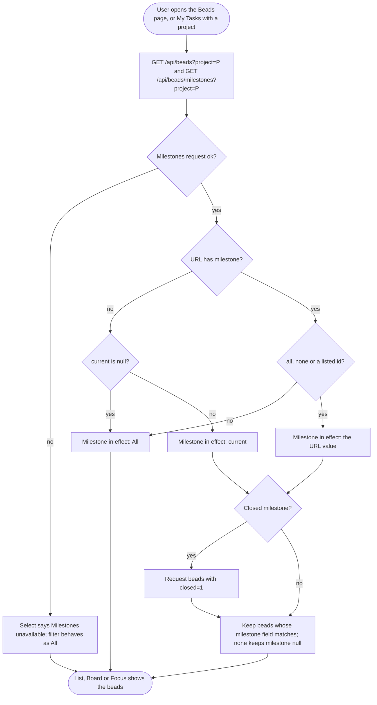

# Milestone filter

How the Beads page and My Tasks decide which milestone filters the beads (REQ-BEADS-001, REQ-BEADS-015, REQ-UI-104, REQ-UI-105).

```mermaid
flowchart TD
  open([User opens the Beads page, or My Tasks with a project]) --> both[GET /api/beads?project=P and GET /api/beads/milestones?project=P]
  both --> ms{Milestones request ok?}
  ms -- no --> unavail[Select says Milestones unavailable; filter behaves as All]
  ms -- yes --> url{URL has milestone?}
  url -- no --> cur{current is null?}
  cur -- yes --> all[Milestone in effect: All]
  cur -- no --> pick[Milestone in effect: current]
  url -- yes --> known{all, none or a listed id?}
  known -- no --> all
  known -- yes --> chosen[Milestone in effect: the URL value]
  pick --> closed{Closed milestone?}
  chosen --> closed
  closed -- yes --> refetch[Request beads with closed=1]
  closed -- no --> filter
  refetch --> filter[Keep beads whose milestone field matches; none keeps milestone null]
  all --> show([List, Board or Focus shows the beads])
  unavail --> show
  filter --> show
```
