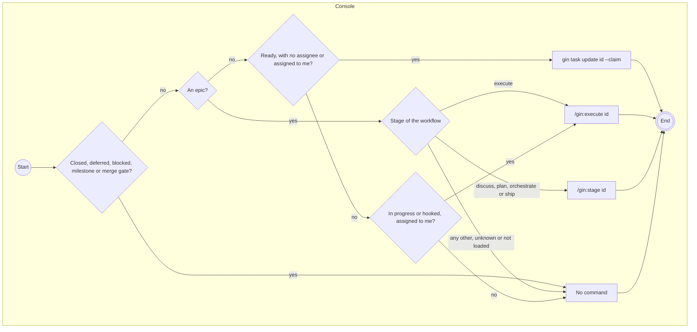

# Next command of a bead

How the console names the one command that continues a bead, from its state, its assignee and, for an epic, its workflow stage (REQ-BEADS-025).

```mermaid
flowchart TD
  subgraph console[Console]
    start((Start))
    blocked{Closed, deferred, blocked, milestone or merge gate?}
    epic{An epic?}
    stage{Stage of the workflow}
    mine{Ready, with no assignee or assigned to me?}
    doing{In progress or hooked, assigned to me?}
    claim["gin task update id --claim"]
    run["/gin:execute id"]
    go["/gin:stage id"]
    none[No command]
    done(((End)))
  end
  start --> blocked
  blocked -->|yes| none
  blocked -->|no| epic
  epic -->|yes| stage
  epic -->|no| mine
  stage -->|discuss, plan, orchestrate or ship| go
  stage -->|execute| run
  stage -->|any other, unknown or not loaded| none
  mine -->|yes| claim
  mine -->|no| doing
  doing -->|yes| run
  doing -->|no| none
  claim --> done
  run --> done
  go --> done
  none --> done
```
