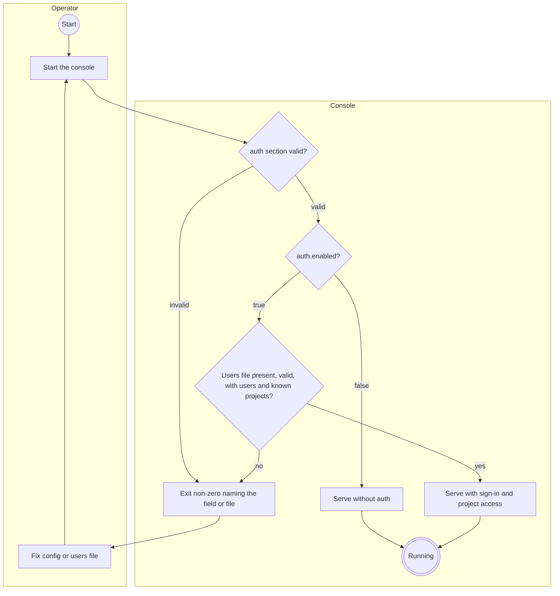

# Auth settings activity

How the console reads the `auth` section and the users file at startup.

```mermaid
flowchart TD
  subgraph operator[Operator]
    start((Start))
    launch[Start the console]
    fix[Fix config or users file]
  end
  subgraph system[Console]
    parse{auth section valid?}
    enabled{auth.enabled?}
    users{Users file present, valid, with users and known projects?}
    stop[Exit non-zero naming the field or file]
    noauth[Serve without auth]
    withauth[Serve with sign-in and project access]
    done(((Running)))
  end
  start --> launch
  launch --> parse
  parse -->|invalid| stop
  parse -->|valid| enabled
  enabled -->|false| noauth
  enabled -->|true| users
  users -->|no| stop
  users -->|yes| withauth
  stop --> fix
  fix --> launch
  noauth --> done
  withauth --> done
```
