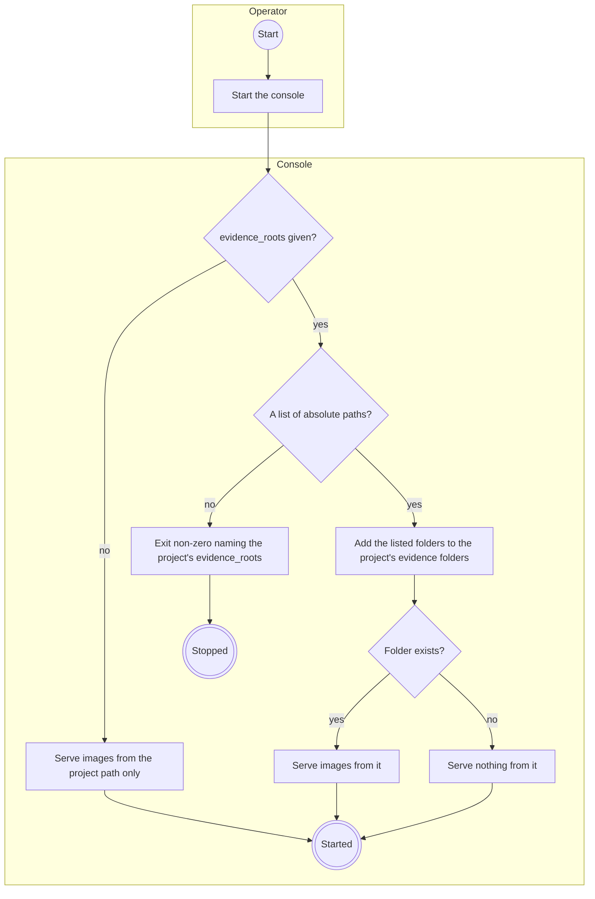

# Evidence folders

How the console reads `evidence_roots` of each project at startup (REQ-CONFIG-008).

```mermaid
flowchart TD
  subgraph operator[Operator]
    start((Start))
    run[Start the console]
  end
  subgraph system[Console]
    given{evidence_roots given?}
    project[Serve images from the project path only]
    list{A list of absolute paths?}
    folders[Add the listed folders to the project's evidence folders]
    exists{Folder exists?}
    serve[Serve images from it]
    skip[Serve nothing from it]
    refuse[Exit non-zero naming the project's evidence_roots]
    done(((Started)))
    stopped(((Stopped)))
  end
  start --> run
  run --> given
  given -->|no| project
  given -->|yes| list
  list -->|no| refuse
  list -->|yes| folders
  folders --> exists
  exists -->|yes| serve
  exists -->|no| skip
  project --> done
  serve --> done
  skip --> done
  refuse --> stopped
```
