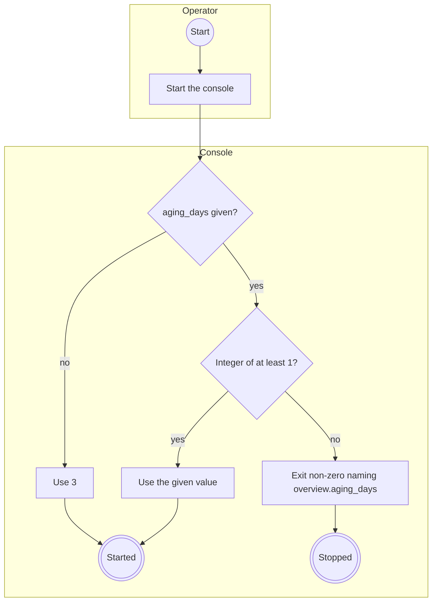

# Overview settings

How the console reads `overview.aging_days` at startup (REQ-CONFIG-007).

```mermaid
flowchart TD
  subgraph operator[Operator]
    start((Start))
    run[Start the console]
  end
  subgraph system[Console]
    given{aging_days given?}
    use[Use 3]
    valid{Integer of at least 1?}
    set[Use the given value]
    refuse[Exit non-zero naming overview.aging_days]
    done(((Started)))
    stopped(((Stopped)))
  end
  start --> run
  run --> given
  given -->|no| use
  given -->|yes| valid
  valid -->|yes| set
  valid -->|no| refuse
  use --> done
  set --> done
  refuse --> stopped
```
