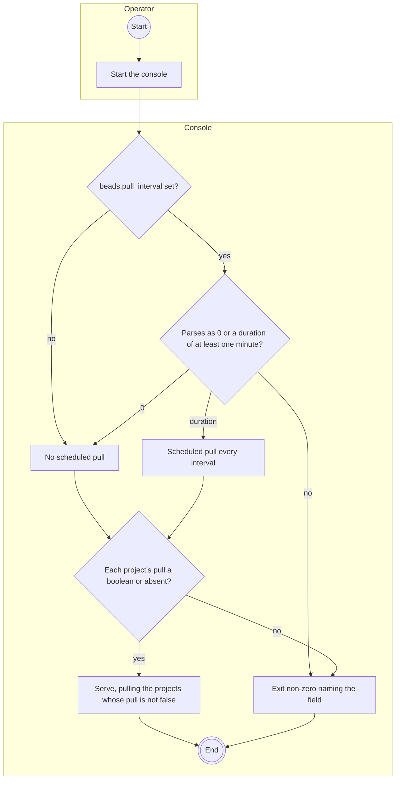

# Pull settings

How the console reads `beads.pull_interval` and each project's `pull` at startup (REQ-CONFIG-006, REQ-CONFIG-003).

```mermaid
flowchart TD
  subgraph operator[Operator]
    start((Start))
    launch[Start the console]
  end
  subgraph console[Console]
    beads{beads.pull_interval set?}
    parse{Parses as 0 or a duration of at least one minute?}
    off[No scheduled pull]
    sched[Scheduled pull every interval]
    pull{Each project's pull a boolean or absent?}
    stop[Exit non-zero naming the field]
    run[Serve, pulling the projects whose pull is not false]
    done(((End)))
  end
  start --> launch
  launch --> beads
  beads -->|no| off
  beads -->|yes| parse
  parse -->|no| stop
  parse -->|0| off
  parse -->|duration| sched
  off --> pull
  sched --> pull
  pull -->|no| stop
  pull -->|yes| run
  run --> done
  stop --> done
```
