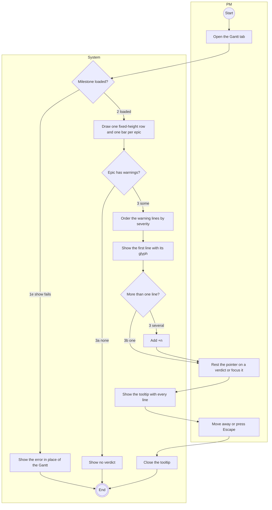

# Gantt verdict

Use case: read-gantt-verdict

How a Gantt row turns its epic's warnings into at most one verdict line and a tooltip (REQ-MILESTONE-UI-024).

```mermaid
flowchart TD
  subgraph pm[PM]
    start((Start))
    open[Open the Gantt tab]
    hover[Rest the pointer on a verdict or focus it]
    leave[Move away or press Escape]
  end
  subgraph system[System]
    load{Milestone loaded?}
    fail[Show the error in place of the Gantt]
    rows[Draw one fixed-height row and one bar per epic]
    any{Epic has warnings?}
    none[Show no verdict]
    order[Order the warning lines by severity]
    first[Show the first line with its glyph]
    more{More than one line?}
    plus[Add +n]
    tip[Show the tooltip with every line]
    close[Close the tooltip]
    done(((End)))
  end
  start --> open
  open --> load
  load -->|1e show fails| fail
  load -->|2 loaded| rows
  fail --> done
  rows --> any
  any -->|3a none| none
  any -->|3 some| order
  order --> first
  first --> more
  more -->|3b one| hover
  more -->|3 several| plus
  plus --> hover
  none --> done
  hover --> tip
  tip --> leave
  leave --> close
  close --> done
```
