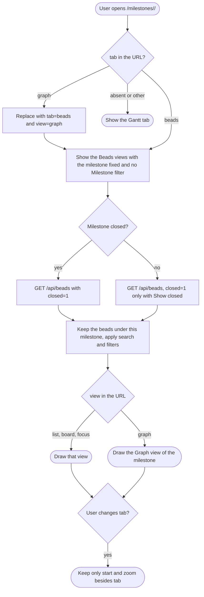

# Milestone Beads tab

How the milestone page picks its tab and shows the milestone's beads in the Beads views (REQ-MILESTONE-UI-018, REQ-MILESTONE-UI-002).

```mermaid
flowchart TD
  open([User opens /milestones/<project>/<id>]) --> tab{tab in the URL?}
  tab -- graph --> redirect[Replace with tab=beads and view=graph]
  redirect --> beads
  tab -- beads --> beads[Show the Beads views with the milestone fixed and no Milestone filter]
  tab -- absent or other --> gantt([Show the Gantt tab])
  beads --> closed{Milestone closed?}
  closed -- yes --> fetchc[GET /api/beads with closed=1]
  closed -- no --> fetch[GET /api/beads, closed=1 only with Show closed]
  fetchc --> view
  fetch --> view[Keep the beads under this milestone, apply search and filters]
  view --> which{view in the URL}
  which -- list, board, focus --> lists([Draw that view])
  which -- graph --> graphv([Draw the Graph view of the milestone])
  lists --> change{User changes tab?}
  graphv --> change
  change -- yes --> keep([Keep only start and zoom besides tab])
```
