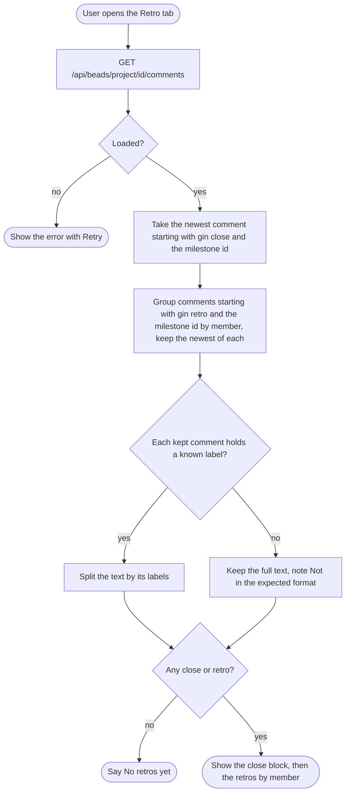

# Milestone Retro tab

How the Retro tab of the milestone page reads the milestone bead's comments (REQ-MILESTONE-UI-019).

```mermaid
flowchart TD
  open([User opens the Retro tab]) --> fetch[GET /api/beads/project/id/comments]
  fetch --> ok{Loaded?}
  ok -- no --> err([Show the error with Retry])
  ok -- yes --> close[Take the newest comment starting with gin close and the milestone id]
  close --> retro[Group comments starting with gin retro and the milestone id by member, keep the newest of each]
  retro --> labels{Each kept comment holds a known label?}
  labels -- yes --> split[Split the text by its labels]
  labels -- no --> raw[Keep the full text, note Not in the expected format]
  split --> any{Any close or retro?}
  raw --> any
  any -- no --> empty([Say No retros yet])
  any -- yes --> show([Show the close block, then the retros by member])
```
