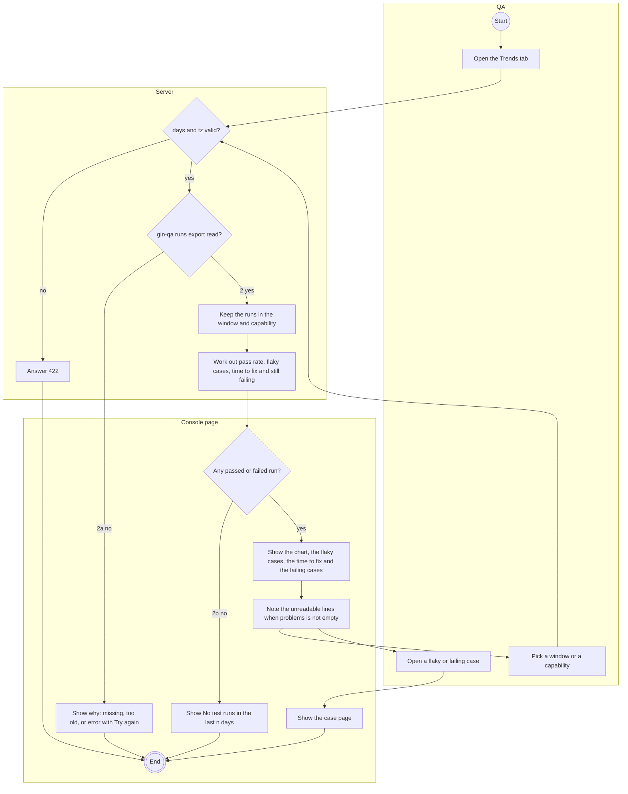

# Test trends

Use case: review-test-trends

How the console reads the run history of a project and shows the pass rate per day, the flaky cases and the time to fix (REQ-QA-014 to REQ-QA-019).

```mermaid
flowchart TD
  subgraph qa[QA]
    start((Start))
    open[Open the Trends tab]
    pick[Pick a window or a capability]
    caseLink[Open a flaky or failing case]
  end
  subgraph server[Server]
    valid{days and tz valid?}
    bad[Answer 422]
    export{gin-qa runs export read?}
    cut[Keep the runs in the window and capability]
    compute[Work out pass rate, flaky cases, time to fix and still failing]
  end
  subgraph page[Console page]
    why[Show why: missing, too old, or error with Try again]
    any{Any passed or failed run?}
    empty[Show No test runs in the last n days]
    show[Show the chart, the flaky cases, the time to fix and the failing cases]
    note[Note the unreadable lines when problems is not empty]
    casePage[Show the case page]
    finish(((End)))
  end
  start --> open
  open --> valid
  valid -->|no| bad
  valid -->|yes| export
  export -->|2a no| why
  export -->|2 yes| cut
  cut --> compute
  compute --> any
  any -->|2b no| empty
  any -->|yes| show
  show --> note
  note --> pick
  pick --> valid
  note --> caseLink
  caseLink --> casePage
  casePage --> finish
  bad --> finish
  why --> finish
  empty --> finish
```
