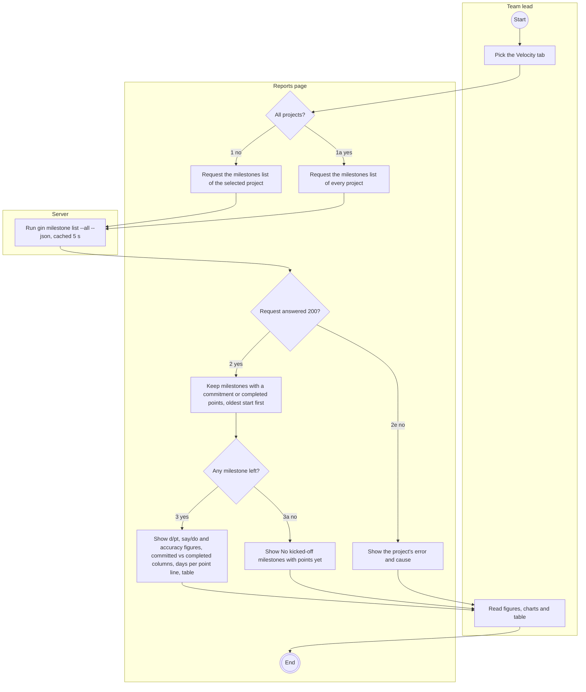

# Velocity tab

Use case: review-velocity

How the Reports Velocity tab gets each project's velocity from the Milestones API and draws it (REQ-REPORTS-018, REQ-UI-095, REQ-MILESTONE-UI-008).

```mermaid
flowchart TD
  subgraph lead[Team lead]
    start((Start))
    pick[Pick the Velocity tab]
    read[Read figures, charts and table]
  end
  subgraph browser[Reports page]
    scope{All projects?}
    one[Request the milestones list of the selected project]
    each[Request the milestones list of every project]
    ok{Request answered 200?}
    err[Show the project's error and cause]
    filter[Keep milestones with a commitment or completed points, oldest start first]
    any{Any milestone left?}
    none[Show No kicked-off milestones with points yet]
    draw[Show d/pt, say/do and accuracy figures, committed vs completed columns, days per point line, table]
    done(((End)))
  end
  subgraph server[Server]
    gin[Run gin milestone list --all --json, cached 5 s]
  end
  start --> pick
  pick --> scope
  scope -->|1 no| one
  scope -->|1a yes| each
  one --> gin
  each --> gin
  gin --> ok
  ok -->|2 yes| filter
  ok -->|2e no| err
  filter --> any
  any -->|3 yes| draw
  any -->|3a no| none
  draw --> read
  none --> read
  err --> read
  read --> done
```
