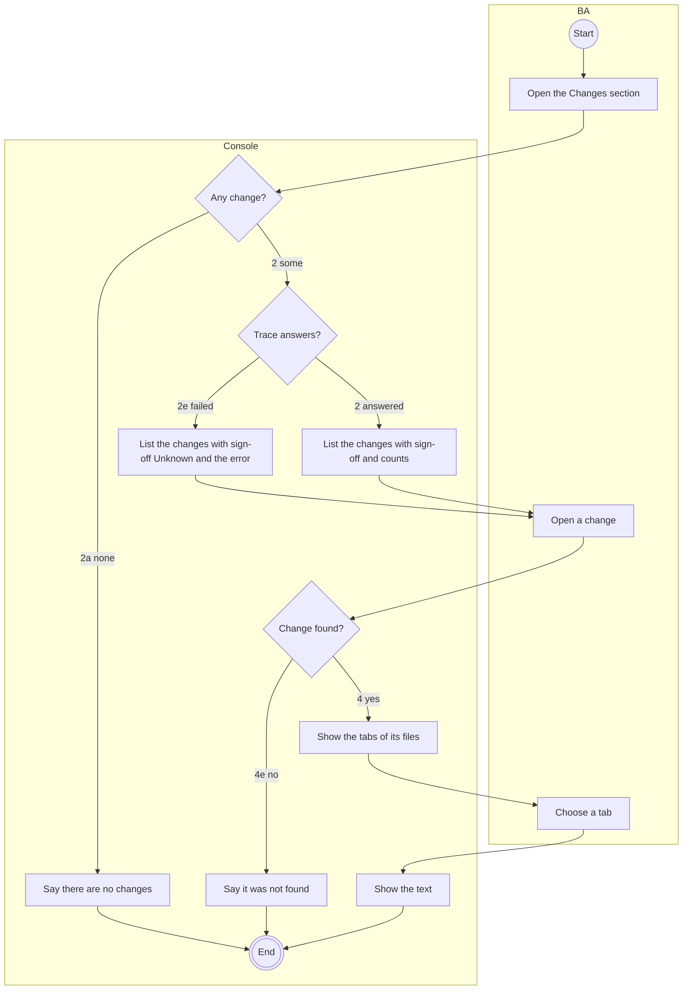

# Changes

How a BA reads a change (REQ-REQUIREMENTS-007, REQ-REQUIREMENTS-008, REQ-REQUIREMENTS-017).

Use case: read-a-change

```mermaid
flowchart TD
  subgraph ba[BA]
    start((Start))
    open[Open the Changes section]
    pick[Open a change]
    tab[Choose a tab]
  end
  subgraph console[Console]
    any{Any change?}
    empty[Say there are no changes]
    trace{Trace answers?}
    plain[List the changes with sign-off Unknown and the error]
    list[List the changes with sign-off and counts]
    found{Change found?}
    missing[Say it was not found]
    page[Show the tabs of its files]
    text[Show the text]
    done(((End)))
  end
  start --> open
  open --> any
  any -->|2a none| empty
  any -->|2 some| trace
  trace -->|2e failed| plain
  trace -->|2 answered| list
  plain --> pick
  list --> pick
  pick --> found
  found -->|4e no| missing
  found -->|4 yes| page
  page --> tab
  tab --> text
  empty --> done
  missing --> done
  text --> done
```
