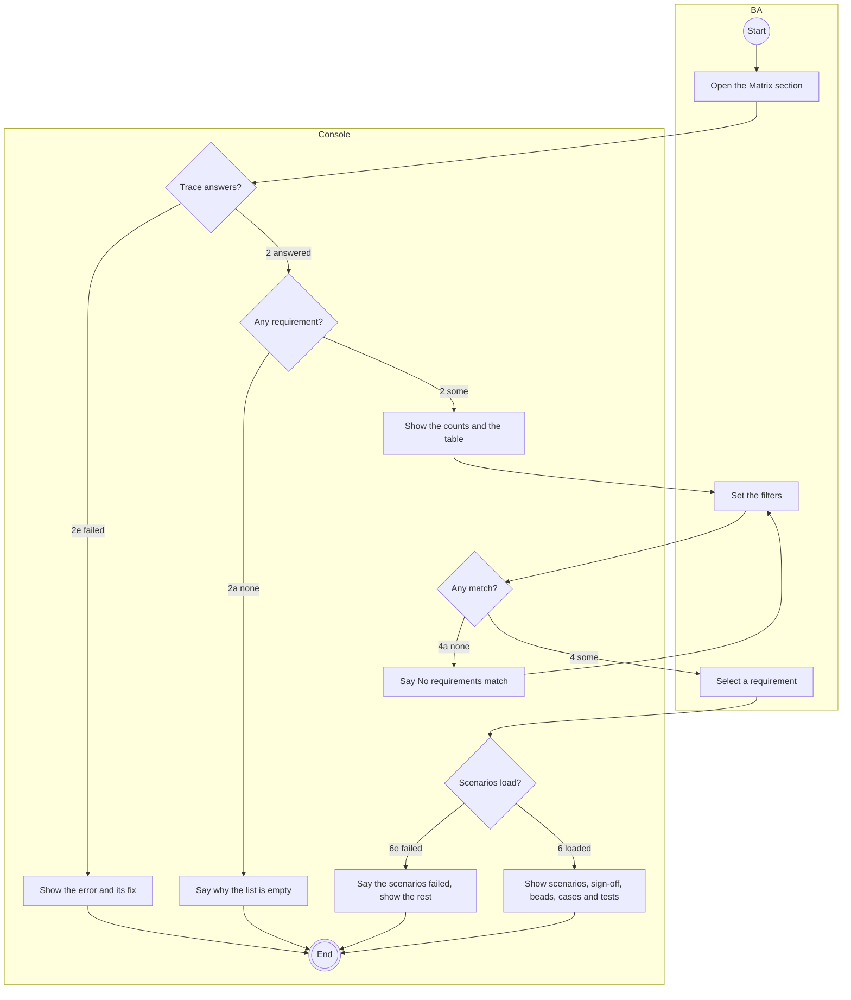

# Requirements matrix

How a BA finds a requirement and traces it (REQ-REQUIREMENTS-001, REQ-REQUIREMENTS-013, REQ-REQUIREMENTS-015).

Use case: trace-a-requirement

```mermaid
flowchart TD
  subgraph ba[BA]
    start((Start))
    open[Open the Matrix section]
    filter[Set the filters]
    pick[Select a requirement]
  end
  subgraph console[Console]
    trace{Trace answers?}
    error[Show the error and its fix]
    any{Any requirement?}
    empty[Say why the list is empty]
    table[Show the counts and the table]
    match{Any match?}
    none[Say No requirements match]
    details{Scenarios load?}
    full[Show scenarios, sign-off, beads, cases and tests]
    part[Say the scenarios failed, show the rest]
    done(((End)))
  end
  start --> open
  open --> trace
  trace -->|2e failed| error
  trace -->|2 answered| any
  any -->|2a none| empty
  any -->|2 some| table
  table --> filter
  filter --> match
  match -->|4a none| none
  none --> filter
  match -->|4 some| pick
  pick --> details
  details -->|6e failed| part
  details -->|6 loaded| full
  error --> done
  empty --> done
  part --> done
  full --> done
```
