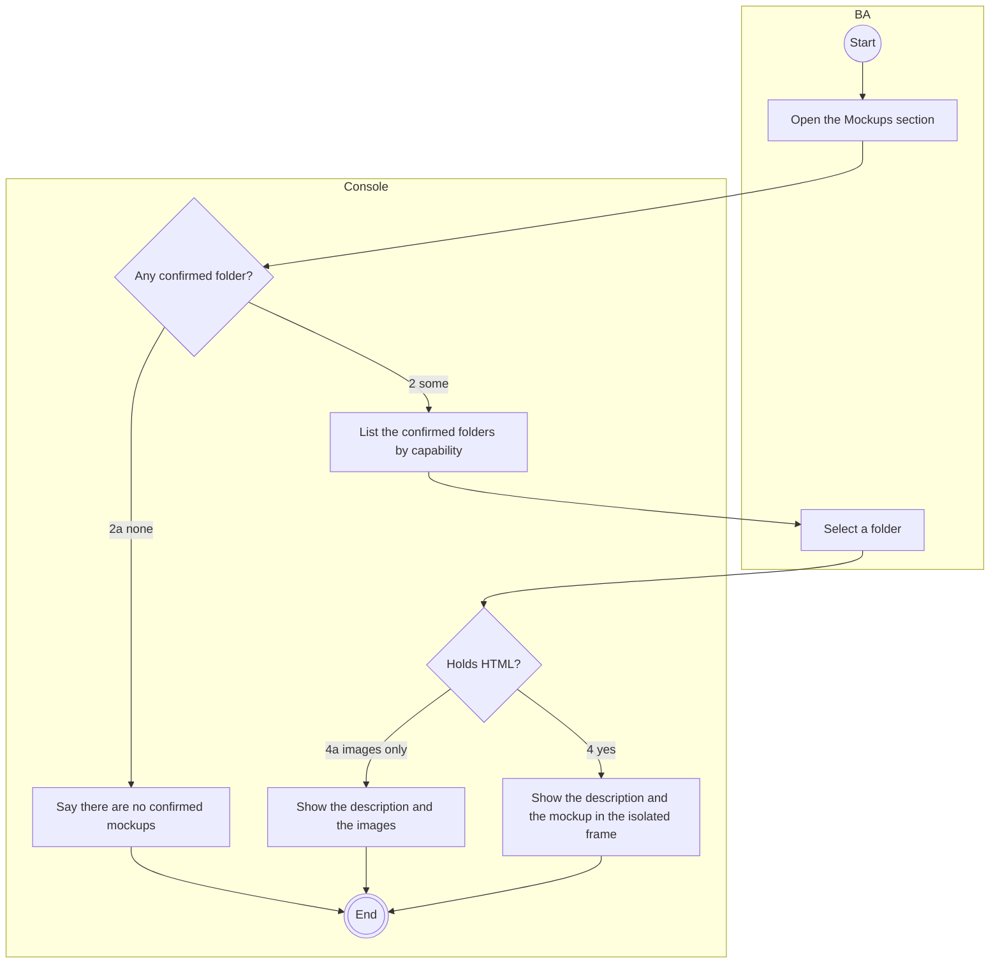

# Mockups

How a BA opens a confirmed mockup (REQ-REQUIREMENTS-009, REQ-REQUIREMENTS-011, REQ-REQUIREMENTS-018).

Use case: open-a-mockup

```mermaid
flowchart TD
  subgraph ba[BA]
    start((Start))
    open[Open the Mockups section]
    pick[Select a folder]
  end
  subgraph console[Console]
    any{Any confirmed folder?}
    empty[Say there are no confirmed mockups]
    list[List the confirmed folders by capability]
    html{Holds HTML?}
    frame[Show the description and the mockup in the isolated frame]
    images[Show the description and the images]
    done(((End)))
  end
  start --> open
  open --> any
  any -->|2a none| empty
  any -->|2 some| list
  list --> pick
  pick --> html
  html -->|4a images only| images
  html -->|4 yes| frame
  empty --> done
  images --> done
  frame --> done
```
