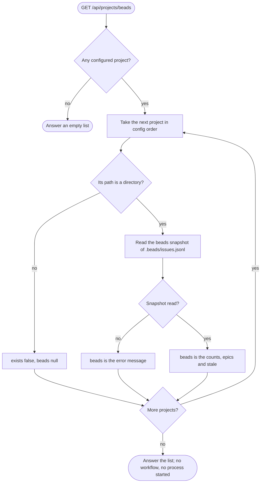

# Project beads

How `GET /api/projects/beads` answers without running `gin` or `bd` (REQ-SERVER-010).

```mermaid
flowchart TD
  start([GET /api/projects/beads]) --> any{Any configured project?}
  any -- no --> empty([Answer an empty list])
  any -- yes --> each[Take the next project in config order]
  each --> dir{Its path is a directory?}
  dir -- no --> missing[exists false, beads null]
  dir -- yes --> snap[Read the beads snapshot of .beads/issues.jsonl]
  snap --> ok{Snapshot read?}
  ok -- no --> err[beads is the error message]
  ok -- yes --> summary[beads is the counts, epics and stale]
  missing --> more{More projects?}
  err --> more
  summary --> more
  more -- yes --> each
  more -- no --> done([Answer the list; no workflow, no process started])
```
