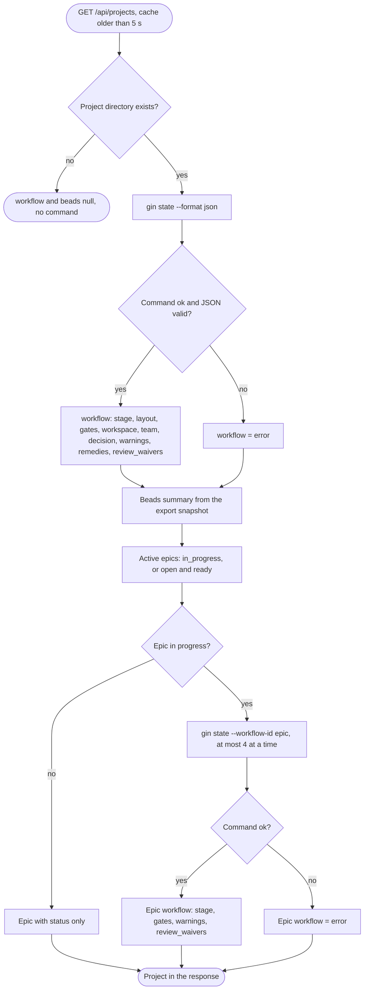

# Project health on the Projects page

How `GET /api/projects` builds a project's `workflow` and the stage of each epic in progress (REQ-SERVER-005, REQ-SERVER-006).

```mermaid
flowchart TD
  start([GET /api/projects, cache older than 5 s]) --> exists{Project directory exists?}
  exists -- no --> none([workflow and beads null, no command])
  exists -- yes --> state[gin state --format json]
  state --> ok{Command ok and JSON valid?}
  ok -- no --> werr[workflow = error]
  ok -- yes --> wf[workflow: stage, layout, gates, workspace, team, decision, warnings, remedies, review_waivers]
  wf --> beads
  werr --> beads[Beads summary from the export snapshot]
  beads --> epics[Active epics: in_progress, or open and ready]
  epics --> each{Epic in progress?}
  each -- no --> ready[Epic with status only]
  each -- yes --> per[gin state --workflow-id epic, at most 4 at a time]
  per --> pok{Command ok?}
  pok -- yes --> stage[Epic workflow: stage, gates, warnings, review_waivers]
  pok -- no --> perr[Epic workflow = error]
  ready --> out([Project in the response])
  stage --> out
  perr --> out
```
