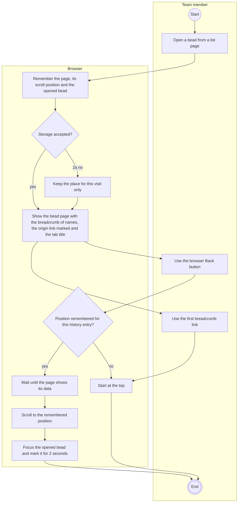

# Back to your place

Use case: return-to-place

How the console remembers where a bead was opened from and restores it on Back (REQ-UI-072, REQ-UI-073, REQ-UI-057, REQ-UI-127).

```mermaid
flowchart TD
  subgraph user[Team member]
    start((Start))
    openBead[Open a bead from a list page]
    back[Use the browser Back button]
    crumb[Use the first breadcrumb link]
    done(((End)))
  end
  subgraph browser[Browser]
    remember[Remember the page, its scroll position and the opened bead]
    stored{Storage accepted?}
    visit[Keep the place for this visit only]
    beadPage[Show the bead page with the breadcrumb of names, the origin link marked and the tab title]
    restore{Position remembered for this history entry?}
    wait[Wait until the page shows its data]
    scroll[Scroll to the remembered position]
    focus[Focus the opened bead and mark it for 2 seconds]
    top[Start at the top]
  end
  start --> openBead
  openBead --> remember
  remember --> stored
  stored -->|yes| beadPage
  stored -->|2a no| visit
  visit --> beadPage
  beadPage --> back
  beadPage --> crumb
  back --> restore
  restore -->|yes| wait
  restore -->|no| top
  wait --> scroll
  scroll --> focus
  focus --> done
  crumb --> top
  top --> done
```
