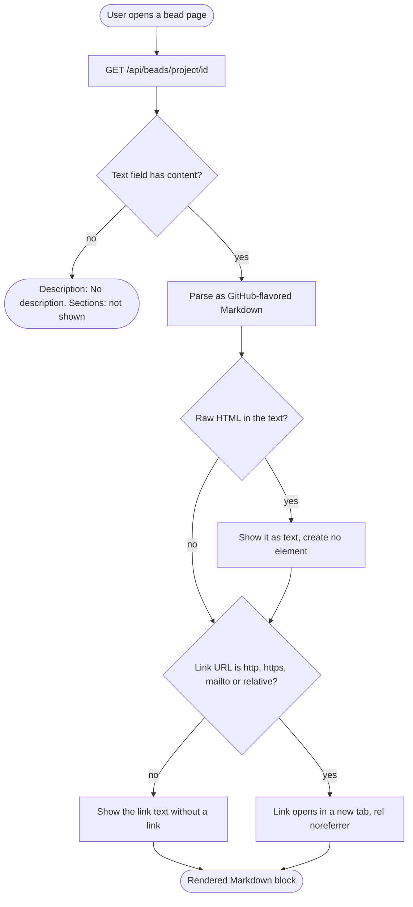

# Bead text as Markdown

How the bead page draws a bead's description, acceptance criteria, design, notes and close reason (REQ-UI-028, REQ-UI-038).

```mermaid
flowchart TD
  open([User opens a bead page]) --> load[GET /api/beads/project/id]
  load --> field{Text field has content?}
  field -- no --> skip([Description: No description. Sections: not shown])
  field -- yes --> parse[Parse as GitHub-flavored Markdown]
  parse --> html{Raw HTML in the text?}
  html -- yes --> text[Show it as text, create no element]
  html -- no --> link
  text --> link{Link URL is http, https, mailto or relative?}
  link -- no --> plain[Show the link text without a link]
  link -- yes --> anchor[Link opens in a new tab, rel noreferrer]
  plain --> done([Rendered Markdown block])
  anchor --> done
```
