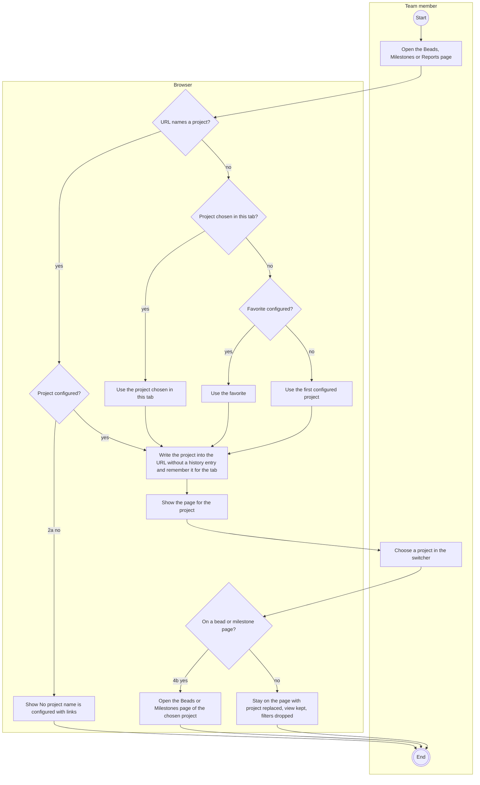

# Current project

Use case: switch-project

How a page picks the project it shows and what the switcher does (REQ-UI-123, REQ-UI-124, REQ-UI-126).

```mermaid
flowchart TD
  subgraph user[Team member]
    start((Start))
    open[Open the Beads, Milestones or Reports page]
    choose[Choose a project in the switcher]
    done(((End)))
  end
  subgraph browser[Browser]
    inUrl{URL names a project?}
    known{Project configured?}
    notice[Show No project name is configured with links]
    tab{Project chosen in this tab?}
    fav{Favorite configured?}
    useTab[Use the project chosen in this tab]
    useFav[Use the favorite]
    useFirst[Use the first configured project]
    write[Write the project into the URL without a history entry and remember it for the tab]
    show[Show the page for the project]
    where{On a bead or milestone page?}
    list[Open the Beads or Milestones page of the chosen project]
    same[Stay on the page with project replaced, view kept, filters dropped]
  end
  start --> open
  open --> inUrl
  inUrl -->|yes| known
  inUrl -->|no| tab
  known -->|2a no| notice
  known -->|yes| write
  tab -->|yes| useTab
  tab -->|no| fav
  fav -->|yes| useFav
  fav -->|no| useFirst
  useTab --> write
  useFav --> write
  useFirst --> write
  write --> show
  show --> choose
  choose --> where
  where -->|4b yes| list
  where -->|no| same
  list --> done
  same --> done
  notice --> done
```
