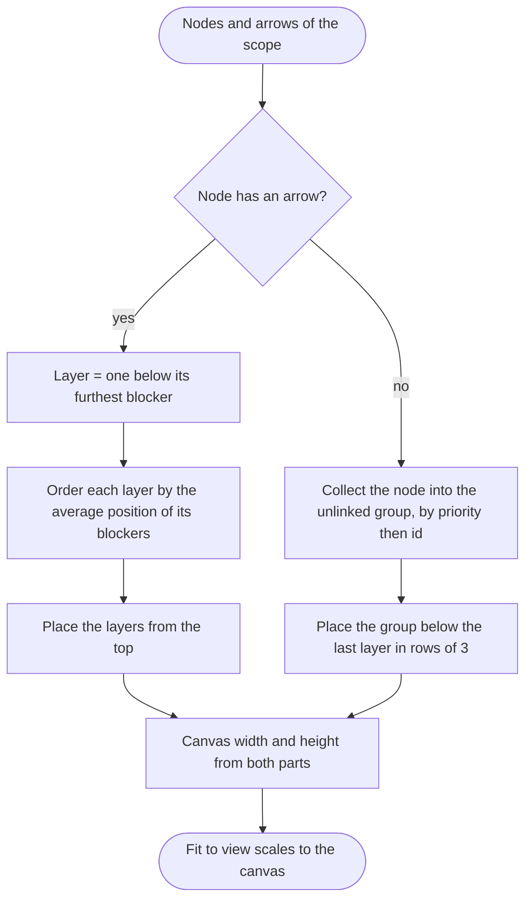

# Graph layout

How the Graph view and the Dependencies page place the nodes of a scope (REQ-UI-048).

```mermaid
flowchart TD
  start([Nodes and arrows of the scope]) --> split{Node has an arrow?}
  split -- yes --> layer[Layer = one below its furthest blocker]
  layer --> order[Order each layer by the average position of its blockers]
  order --> place[Place the layers from the top]
  split -- no --> loose[Collect the node into the unlinked group, by priority then id]
  loose --> grid[Place the group below the last layer in rows of 3]
  place --> size
  grid --> size[Canvas width and height from both parts]
  size --> fit([Fit to view scales to the canvas])
```
