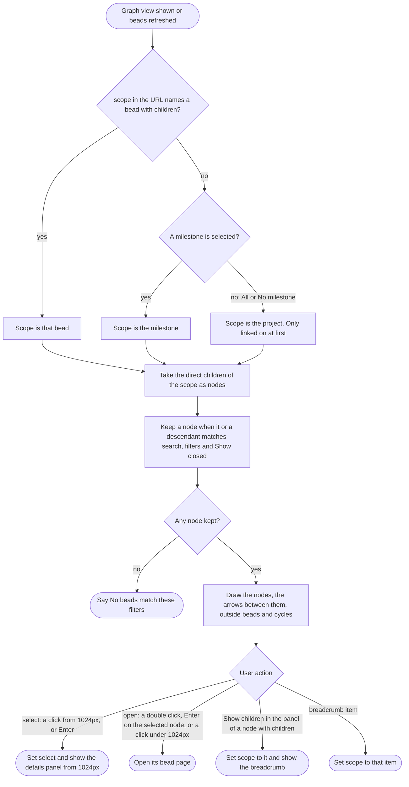

# Graph view

How the Graph view of the Beads views picks its scope, applies the filters, and handles selecting and opening a node (REQ-UI-106, REQ-UI-081, REQ-UI-147, REQ-UI-149).

```mermaid
flowchart TD
  start([Graph view shown or beads refreshed]) --> scope{scope in the URL names a bead with children?}
  scope -- yes --> s1[Scope is that bead]
  scope -- no --> ms{A milestone is selected?}
  ms -- yes --> s2[Scope is the milestone]
  ms -- "no: All or No milestone" --> s3[Scope is the project, Only linked on at first]
  s1 --> nodes
  s2 --> nodes
  s3 --> nodes[Take the direct children of the scope as nodes]
  nodes --> filter[Keep a node when it or a descendant matches search, filters and Show closed]
  filter --> any{Any node kept?}
  any -- no --> empty([Say No beads match these filters])
  any -- yes --> draw[Draw the nodes, the arrows between them, outside beads and cycles]
  draw --> act{User action}
  act -- "select: a click from 1024px, or Enter" --> panel([Set select and show the details panel from 1024px])
  act -- "open: a double click, Enter on the selected node, or a click under 1024px" --> page([Open its bead page])
  act -- "Show children in the panel of a node with children" --> drill([Set scope to it and show the breadcrumb])
  act -- breadcrumb item --> up([Set scope to that item])
```
