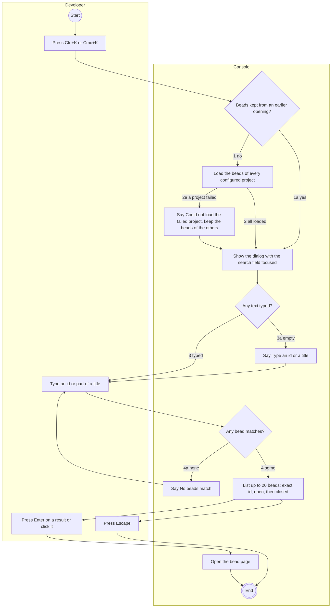

# Jump palette

How Ctrl+K or Cmd+K finds a bead of any project by id or title (REQ-UI-154).

Use case: jump-to-a-bead

```mermaid
flowchart TD
  subgraph user[Developer]
    start((Start))
    key[Press Ctrl+K or Cmd+K]
    type[Type an id or part of a title]
    pick[Press Enter on a result or click it]
    escape[Press Escape]
  end
  subgraph console[Console]
    cached{Beads kept from an earlier opening?}
    load[Load the beads of every configured project]
    part[Say Could not load the failed project, keep the beads of the others]
    open[Show the dialog with the search field focused]
    text{Any text typed?}
    hint[Say Type an id or a title]
    find{Any bead matches?}
    none[Say No beads match]
    list[List up to 20 beads: exact id, open, then closed]
    go[Open the bead page]
    done(((End)))
  end
  start --> key
  key --> cached
  cached -->|1a yes| open
  cached -->|1 no| load
  load -->|2 all loaded| open
  load -->|2e a project failed| part
  part --> open
  open --> text
  text -->|3a empty| hint
  hint --> type
  text -->|3 typed| type
  type --> find
  find -->|4a none| none
  none --> type
  find -->|4 some| list
  list --> pick
  list --> escape
  escape --> done
  pick --> go
  go --> done
```
