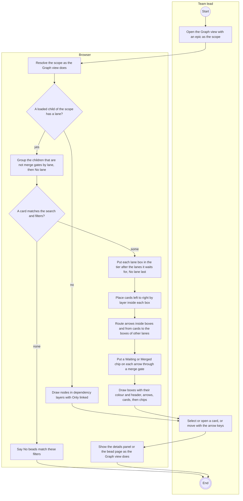

# Lane clusters in the Graph view

Use case: follow-epic-lanes

How the Graph view of an epic with lanes draws lane boxes instead of layers (REQ-UI-117, REQ-UI-118).

```mermaid
flowchart TD
  subgraph user[Team lead]
    start((Start))
    open[Open the Graph view with an epic as the scope]
    pick[Select or open a card, or move with the arrow keys]
    done(((End)))
  end
  subgraph browser[Browser]
    resolve[Resolve the scope as the Graph view does]
    hasLanes{A loaded child of the scope has a lane?}
    layers[Draw nodes in dependency layers with Only linked]
    group[Group the children that are not merge gates by lane, then No lane]
    match{A card matches the search and filters?}
    none[Say No beads match these filters]
    tiers[Put each lane box in the tier after the lanes it waits for, No lane last]
    cards[Place cards left to right by layer inside each box]
    route[Route arrows inside boxes and from cards to the boxes of other lanes]
    chips[Put a Waiting or Merged chip on each arrow through a merge gate]
    draw[Draw boxes with their colour and header, arrows, cards, then chips]
    panel[Show the details panel or the bead page as the Graph view does]
  end
  start --> open
  open --> resolve
  resolve --> hasLanes
  hasLanes -->|no| layers
  hasLanes -->|yes| group
  layers --> pick
  group --> match
  match -->|none| none
  none --> done
  match -->|some| tiers
  tiers --> cards
  cards --> route
  route --> chips
  chips --> draw
  draw --> pick
  pick --> panel
  panel --> done
```
