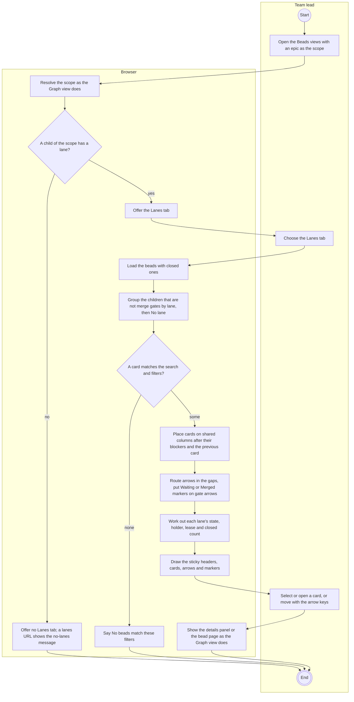

# Lanes view

Use case: follow-epic-lanes

How the Lanes view of an epic is offered and drawn (REQ-UI-111 to REQ-UI-114).

```mermaid
flowchart TD
  subgraph user[Team lead]
    start((Start))
    open[Open the Beads views with an epic as the scope]
    choose[Choose the Lanes tab]
    pick[Select or open a card, or move with the arrow keys]
    done(((End)))
  end
  subgraph browser[Browser]
    resolve[Resolve the scope as the Graph view does]
    hasLanes{A child of the scope has a lane?}
    noTab[Offer no Lanes tab; a lanes URL shows the no-lanes message]
    tab[Offer the Lanes tab]
    load[Load the beads with closed ones]
    group[Group the children that are not merge gates by lane, then No lane]
    match{A card matches the search and filters?}
    none[Say No beads match these filters]
    place[Place cards on shared columns after their blockers and the previous card]
    route[Route arrows in the gaps, put Waiting or Merged markers on gate arrows]
    header[Work out each lane's state, holder, lease and closed count]
    draw[Draw the sticky headers, cards, arrows and markers]
    panel[Show the details panel or the bead page as the Graph view does]
  end
  start --> open
  open --> resolve
  resolve --> hasLanes
  hasLanes -->|no| noTab
  hasLanes -->|yes| tab
  noTab --> done
  tab --> choose
  choose --> load
  load --> group
  group --> match
  match -->|none| none
  match -->|some| place
  none --> done
  place --> route
  route --> header
  header --> draw
  draw --> pick
  pick --> panel
  panel --> done
```
