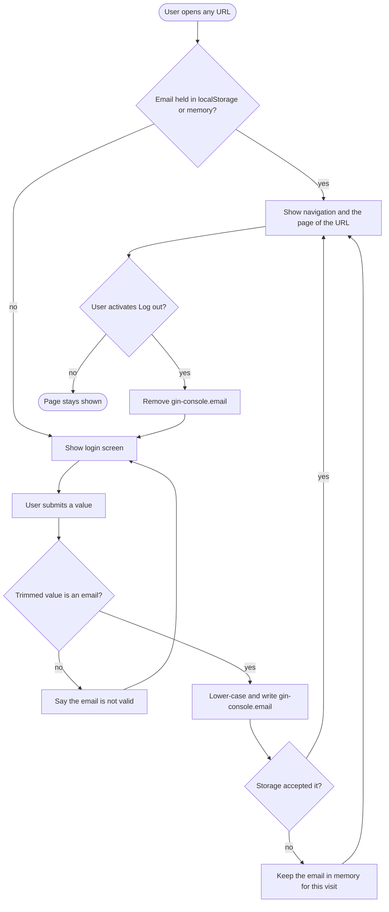

# Login

How the frontend decides between the login screen and the app, and how the email is stored and forgotten (REQ-UI-097, REQ-UI-098).

```mermaid
flowchart TD
  open([User opens any URL]) --> held{Email held in localStorage or memory?}
  held -- yes --> app[Show navigation and the page of the URL]
  held -- no --> login[Show login screen]
  login --> submit[User submits a value]
  submit --> valid{Trimmed value is an email?}
  valid -- no --> invalid[Say the email is not valid] --> login
  valid -- yes --> store[Lower-case and write gin-console.email]
  store --> ok{Storage accepted it?}
  ok -- yes --> app
  ok -- no --> memory[Keep the email in memory for this visit] --> app
  app --> logout{User activates Log out?}
  logout -- yes --> clear[Remove gin-console.email] --> login
  logout -- no --> done([Page stays shown])
```
