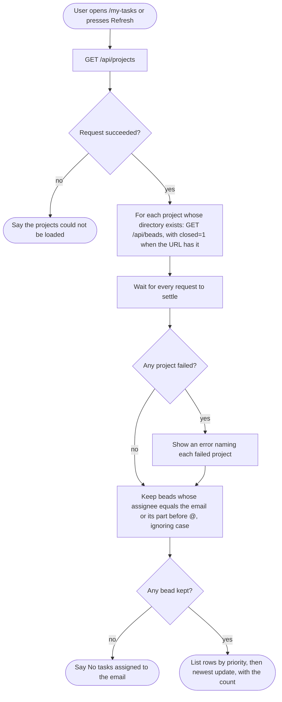

# My Tasks

How the My Tasks page loads the beads assigned to the signed-in email across projects (REQ-UI-100, REQ-UI-101, REQ-UI-102).

```mermaid
flowchart TD
  open([User opens /my-tasks or presses Refresh]) --> projects[GET /api/projects]
  projects --> pok{Request succeeded?}
  pok -- no --> perr([Say the projects could not be loaded])
  pok -- yes --> each[For each project whose directory exists: GET /api/beads, with closed=1 when the URL has it]
  each --> settled[Wait for every request to settle]
  settled --> failed{Any project failed?}
  failed -- yes --> alert[Show an error naming each failed project]
  failed -- no --> match
  alert --> match[Keep beads whose assignee equals the email or its part before @, ignoring case]
  match --> any{Any bead kept?}
  any -- no --> empty([Say No tasks assigned to the email])
  any -- yes --> list([List rows by priority, then newest update, with the count])
```
