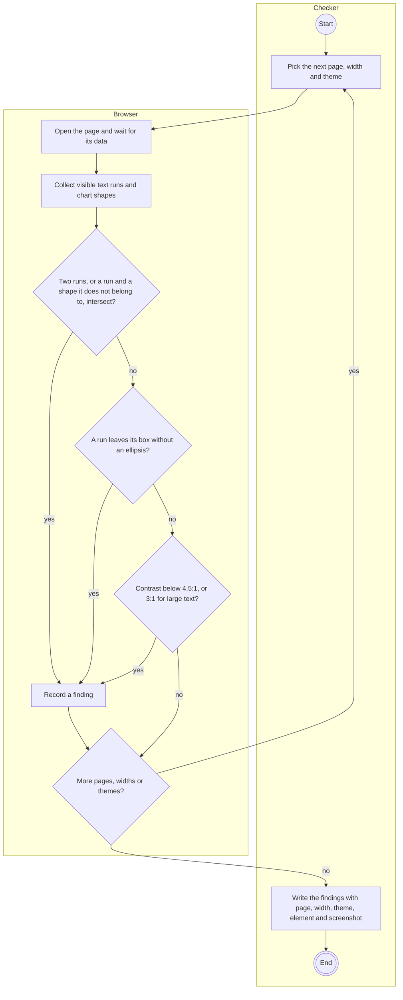

# Readability check

How the readability check of REQ-UI-110 walks the console's pages and reports text that overlaps, spills or lacks contrast (used by TC-1 and rerun after UI changes).

```mermaid
flowchart TD
  subgraph checker[Checker]
    start((Start))
    pick[Pick the next page, width and theme]
    report[Write the findings with page, width, theme, element and screenshot]
    done(((End)))
  end
  subgraph browser[Browser]
    load[Open the page and wait for its data]
    runs[Collect visible text runs and chart shapes]
    overlap{Two runs, or a run and a shape it does not belong to, intersect?}
    spill{A run leaves its box without an ellipsis?}
    contrast{Contrast below 4.5:1, or 3:1 for large text?}
    finding[Record a finding]
    more{More pages, widths or themes?}
  end
  start --> pick
  pick --> load
  load --> runs
  runs --> overlap
  overlap -->|yes| finding
  overlap -->|no| spill
  spill -->|yes| finding
  spill -->|no| contrast
  contrast -->|yes| finding
  contrast -->|no| more
  finding --> more
  more -->|yes| pick
  more -->|no| report
  report --> done
```
